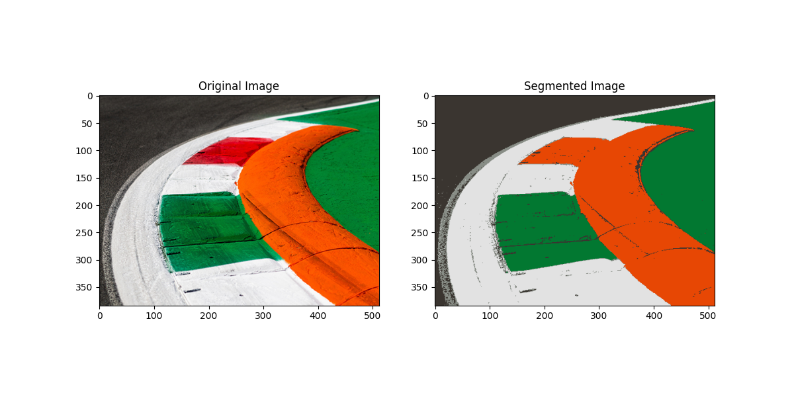

# UAS Pengolahan Citra
<table>
  <tr>
    <th colspan="3">DATA MAHASISWA</th>
  </tr>
  <tr>
    <td>NAMA</td>
    <td>NIM</td>
    <td>KELAS</td>
  </tr>
  <tr>
    <td>Galva Al Godzali</td>
    <td>312210356</td>
    <td rowspan="4">TI.22.A3</td>
  </tr>
  <tr>
    <td>Rafif Isdarufa Athallah</td>
    <td>312210299</td>
  </tr>
  <tr>
    <td>Wisnu Ikhwansyah Saputra</td>
    <td>312210305</td>
  </tr>
  <tr>
    <td>Alif Nur Fathlii Amarta</td>
    <td>312210326</td>
  </tr>
</table>

### Hasil 1

### Hasil 2 

### Hasil 3

### Hasil 4

